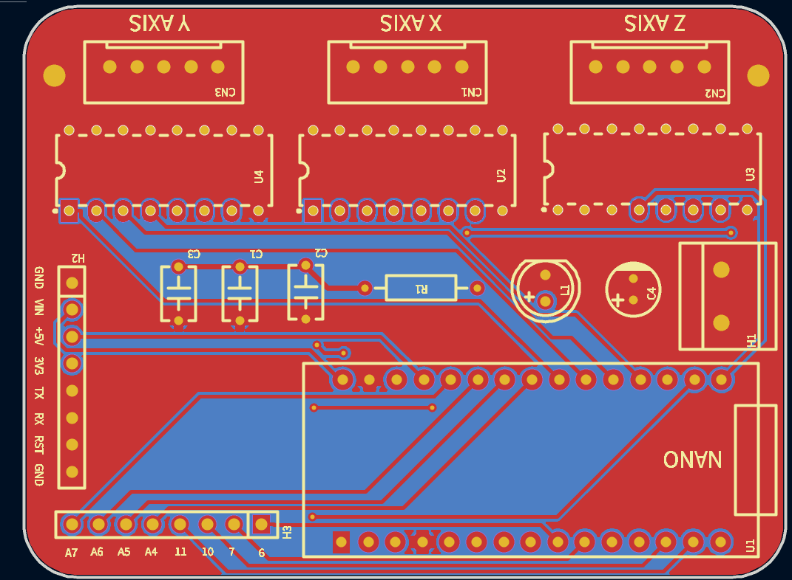

# Day 1: Brainstorming, and first steps
I'm trying to imagine how this thing would work, I was thinking of belt drives at first, but then i felt that it wouldn't be very accurate.

For now I'm making a list of the components I'll be using.

The list:
- Arduino Nano for control
- 3x Stepper motors (Model: 28BYJ-48)
- 3x Stepper motor drivers (Model: ULN2003)
- 3D printed frame

These are the main components at least, I didn't think of the other small components I'll need, like capacitors and stuff

PCB is now done, the PCB will be used to fit the controller (Arduino), and motor drivers all on one board while also 'uniting' the power input. The PCB design, gerber files, and bill of materials are done, though I'm sure the prices in the BOM will differ from reality since I won't be buying from JLCPCB.

Image of PCB:
