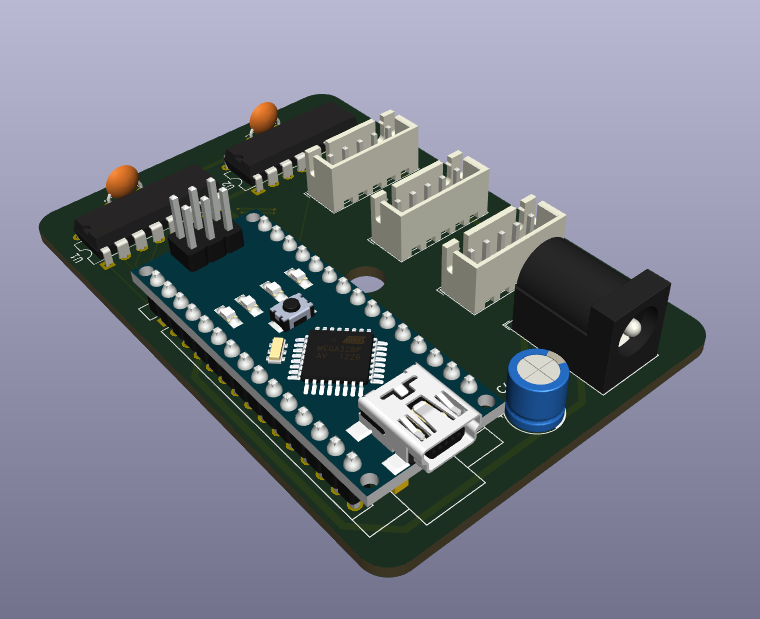

Total time spent: 19 hours and 49 minutes
Total cost of parts (as of the time of writing this line and without 3D printing): 1,456.75 EGP or 29.37 USD
Approx. 3D printing cost: 315 EGP or 6.35 USD

# [2025-06-09] [Time spent: 6 hours] Day 1: Brainstorming, and first steps
First let's get the idea of my project cleared up, I wanna make a mini CNC plotter that I can use to draw/trace PCBs on copper plates so that I can manufacture simple 1 layer PCBs at home.

I'm trying to imagine how this thing would work, I was thinking of belt drives at first, but then I felt that it wouldn't be very accurate.

For now I'm making a list of the components I'll be using.

So I found a similar project online that I'll be taking inspiration from for this project, and it utilizes the following components

The list:
- Arduino Nano for control
- 3x Stepper motors (Model: 28BYJ-48)
- 3x Stepper motor drivers (Model: ULN2003)
- 3D printed frame

These are the main components at least, I didn't think of the other small components I'll need, like capacitors and stuff

Started designing the PCB in KiCad, and making a BOM as I go.

Finished PCB design, FINALLY. The pcb took HOURS to finish, made me wish I had gone with the breadboard method instead. Hoping it works when I actually order it 😭🙏🏻

The PCB has the 3 motor drivers connected to the GPIO on the Arduino, and there are some capacitors to minimize flyback voltage from the motors, I added a barrel jack to power the Arduino and the motors, they are wired in parallel though and I'm not sure if that's dangerous.

And also I will not be soldering the Arduino onto the board because that would be a waste of a perfectly good dev board so I'll use female pin headers in its place during assebly

PCB Images: 
Schematic: 

PCB Design: 

PCB Model: 

# [2025-06-10] [Time spent: 9 hours and 25 minutes] Day 2: 3D modeling
It's 6:35 AM as of writing this, I haven't slept yet since finishing the PCB (started Day one at 10 PM yesterday, finished at 4:45 AM). I've decided to start working on the 3D models I'll need for this project, idk anything about CAD and idk how I'm gonna get the motors to move the pointer/pen correctly, so I'm gonna start by making a case for the control board I designed yesterday.

The program I've decided to use is Fusion 360, no specific reason why I chose it. Currently watching a tutorial on how to use it since it's my first time in a CAD software.

Took some measurements from the PCB in KiCad so I can make the case as much of a tight fit as I can.

Put some mounting holes in the PCB and put some holes in the case for the PCB to be screwed into.

Man I didn't realize Fusion was such a pain 😫, all the YouTubers made it seem like the best CAD software ever or sum.

CREATED A CUBE 🔥🔥🔥 
HOLLOWED THE CUBE 🔥🔥🔥

I left a 1 mm clearance between the case walls and the and the PCB itself, and made a lid.

Added opening for motor cables (Almost forgot that)

Finally done with the case, can't beleive I spent that much time on this case, it is now 7:57 AM, almost one and a half hours on this: 

Aaaand now for the task I've been putting off since the start... the FRAME 💀!!!

Idk how to get started on this tbh, but I'll try, maybe I'll look at similar projects to get an idea about how they calculate the gear teeth number and all those details.

After looking at multiple projects I noticed that most of them used a 9 tooth gear to drive the axis, so I guess I'll be using the same number.

HOW DO I CREATE A GEAR in Fusion!!?!?!

Starting to get sick of tutorials here 

Ok I'm getting there but I'm trying to figure out how to get the shape of the hole in the gear to be like the shape of the shaft of the motor, the gear looks like this for now: 

And this is what the shaft shape looks like, it's called a "Double D" shape: 

FINALLY GOT IT, after lots of tutorials, I finally got the gear right: 

Now comes the easy part, the rails, since I already know the gear's properties I can just use the same ones on the rail/track and they'd mesh together perfectly.

This is the base track, it has mounting holes and a place to mount the motor with the gear attached to it: 

And this is the primary gear track, it meshes with the gear on the motor mounted to the base to control the Y-Axis, it also has a platform to mount the X-Axis base onto it: 

Half the work is now done, the next few parts are going to be easier to model since they're just slightly modified versions of the previous parts.

The X-Axis base is now FINISHED, YIPPEE, it will be mounted on the primary track and will be used to hold the secondary track which will move the Z-Axis motor AKA the Pen motor: 

The secondary track is basically the primary track but with a motor mount instead of the base mount: 

This pretty much concludes the main stuff, like these could somewhat work on their own, but there are some finishing touches I wanted to add.

If you haven't noticed at the end of the X-Axis base there are mounting holes for something, they're for a roller/wheel, it acts as a stand to reduce friction between the X-Axis base and the Y-Axis base, and prevents friction with the surface the CNC Plotter is mounted on by having a rolling wheel, it consists of two parts, the wheel itself and its holder:
- Holder: 

- Wheel: 

Now, all that's left is the Pen holder, it's a combination of two hollow cylinders connected by a rectangle, one of the cylinders has the Double D hole cutout to make it fit onto the Z-Axis motor, I've design multiple different sizes so it can fit all pens/pencils:

After the parts arrive and the frame gets printed I'll get the chance to write the firmware for this project.

# [2025-06-11] [Time spent: 4 Hours and 24 minutes] Day 3: Finalizing
This is probably the last day I'll be working on this, today is just gonna be cleaning up the journal and adding any missing info, checking on the PCB to see if I did something wrong or need to add anything, it is now 8:36 AM, getting started.

Welp after reviewing the PCB and getting the help of HC slack member StrawberryPuding, I realized I only need two ULN2003 chip not three, so I spent the past 2 hours (it's 10:30 rn) modifying the schematic and rerouting the entire PCB, I was able to use two ULNs instead of three and made the board smaller and more compact, I was able to shave off 109 EGP or 2.2 USD from my BOM, here are the pics of the new PCB:

Schematic:

PCB Design:

PCB Model:

The PCB is smaller, you know what that means, right? back to Fusion I go!
I only put one mounting hole on the pcb this time to make designing the box easier.

The PCB is 73x50 mm so I'll make the case 75x52 (Exterior area)

OMG FUSION KEEPS CRASHING MY PC ISTG, fusion has crashed 4 times in the past hour and I can't get anything done from how much it's slowing my pc down.

Took a break from Fusion a bit cause every time I click anything it the app crashes and decided to fill the blank space on the PCB by adding a power LED, I know, pointless, but I just wanted to add something.

After Fusion finally launched I finished the new PCB case and I learned how to use the emboss feature to write YT CNC on it (YT stands for Youssef Tech, my username)

summary of what I did today:
- Redesign the PCB
- Redesign the case for the PCB
- Create the README.md file
- Review the frame models to see if I can improve anything even slightly

Hoping everything works correctly when printed