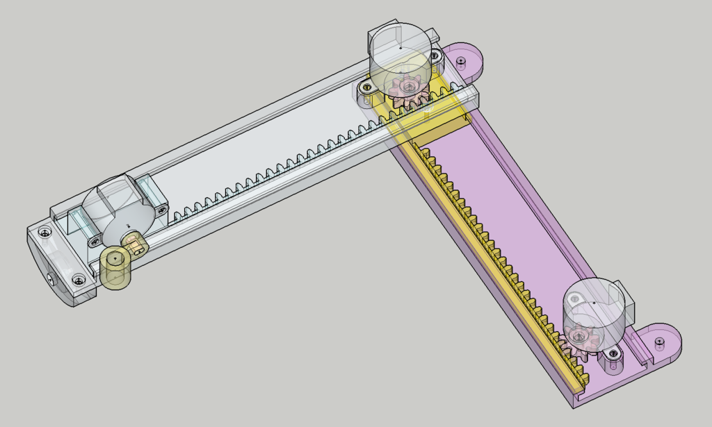
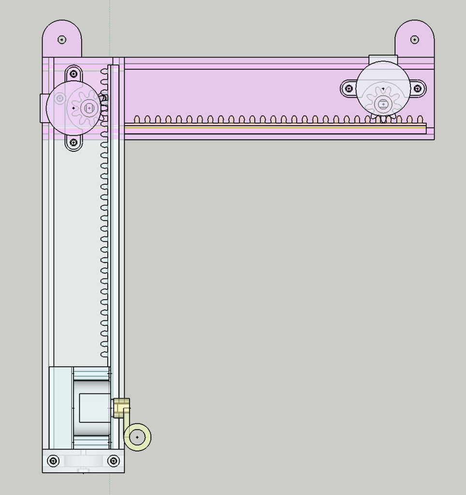
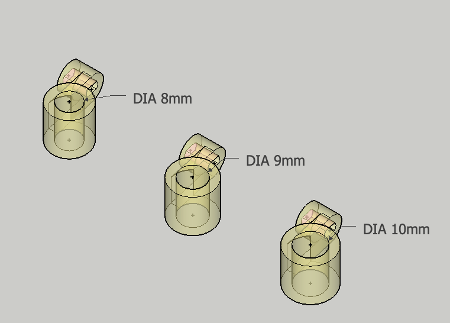
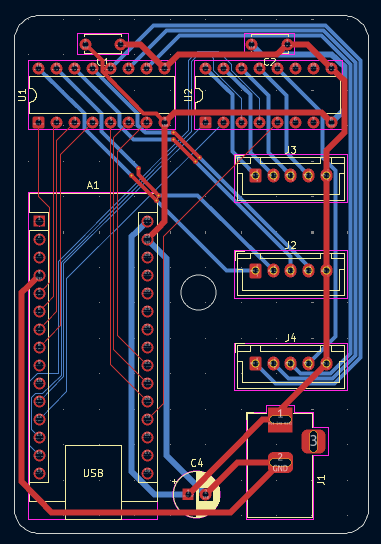
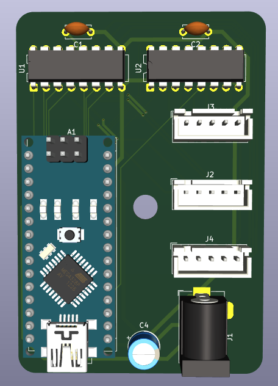
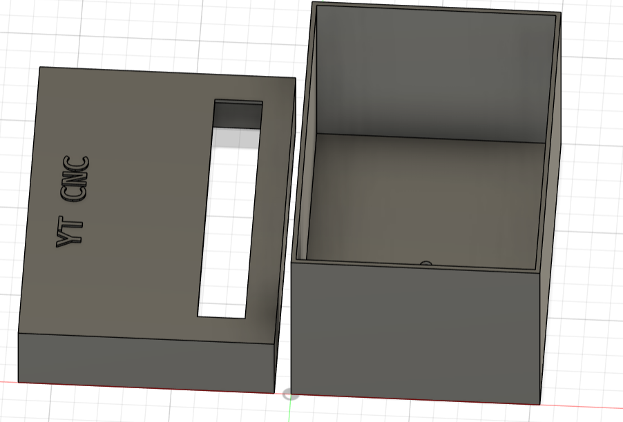

# YT CNC Plotter
This is a hobby project, it's basically a Mini CNC Plotter made using small 5v stepper motors and an Arduino Nano, I'll use it to draw circuits on copper plates to essentially make DIY single layer PCBs.

## Showcase

 

## How does it work?
It uses gear tracks the are moved by the stepper motors, two stepper motors are used to control the X and Y position of the pen and the third motor is used to control the Z position aka the up and down movement of the pen, a script will be used to translate normal G-Code that's used in big CNC machines into something the Arduino can understand.

## How to build?
All you need to do is print the PCB and solder the components specified in the Bill of Materials (BOM) section, or if you don't feel like printing the PCB just put all the components on a breadboard and follow the schematic in my [Journal](JOURNAL.md) for the wiring, then print the frame parts and mount the stepper motors to it and boom, you're done!

## BOM:

| Name                        | Price             | Quantity | Vendor       | Link                                                                                                                                                                                                                                                                                                                                                                                                                                                                                                                                                                                                        | Total Cost                                   |
| --------------------------- | ----------------- | -------- | ------------ | ----------------------------------------------------------------------------------------------------------------------------------------------------------------------------------------------------------------------------------------------------------------------------------------------------------------------------------------------------------------------------------------------------------------------------------------------------------------------------------------------------------------------------------------------------------------------------------------------------------- | -------------------------------------------- |
| Arduino Nano                | ~ 300 EGP         | 1        | Amazon Egypt | [Buy](https://www.amazon.eg/-/en/USB-Arduino-Nano-ATmega328P-Development/dp/B091CMTBF9/ref=sr_1_4?crid=1X8PQ2OLO66YQ&dib=eyJ2IjoiMSJ9.EfDcp_w5TllFTiPv8Fmw4C2VjlOaEKjOiOgfllqMe50VyvVQL165GiVDMQxeZAXarsJ2E95PXOaPtW48t9FeH5PbT_66gKC0o_ztq9BTszoHmayKxNGRTSRWmKhTIU3fsOuePUici85spu26k4xxLyfGFX4Fp57m7xmMx7Y4zb57hNCNhACnG9oMtYCq9yafMF50MA31HwlWvt4hQ-TkZAHA0010Lo856zYRkBGh8pjJP0Xe6N7Sp_cCJNtrQBcY7uGg6iuAfHmvlCNz8U0JhVqjkpi34Vc_PRv41a2vr4I.LRD6HcV5zoDo61TcB5b7rCggmHLi6al8yTJXp0ukraw&dib_tag=se&keywords=arduino+nano&qid=1749506924&sprefix=arduino+nan%2Caps%2C197&sr=8-4)                       | ~ 300 EGP                                    |
| 28BYJ-48 Stepper Motor      | 175 EGP           | 3        | Amazon Egypt | [Buy](https://www.amazon.eg/-/en/DIY-Kit-sourcingmap-28BYJ-48-5V-Phase-Stepper/dp/B0DZXWMGWK/ref=sr_1_13?crid=1ZMAWI7AFFZN&dib=eyJ2IjoiMSJ9.eOrVFMI6iFLPJhr676j4xB9pPxnW-4T21PyQg5wgpvAZACEMzFYdDeivv0Ch45w8zvDZn9DKJlhg5sDG_Br_Zh2GIYCIMzhs6-3RMghTAbzHnRgH_OeHmOcKgnlllamJaqZwsLMmypq_09LR4Zvk9lwa2npcaXmJGhA8iirrMDo8SxlYCvntoAtt-tj5Oqj-WWY6-hdqFvzdAN78V8sQ_EKXllu6kzGcCj7ADP2uLWyVqJG7-I_2h4T4HYTImIDun2VBtQ-nWEvvSSTvYOS84T9h6LiatnvO67Ss_DzSiSY.MvK00w2CuQ-y6f2SJ82isSjLGzd2rGOuaQliAOQx2ww&dib_tag=se&keywords=stepper+motor+28byj-48&qid=1749506700&sprefix=stepper+motor+28%2Caps%2C657&sr=8-13) | 525 EGP                                      |
| ULN2003A Motor Driver Chips | 64 EGP            | 2        | Amazon Egypt | [Buy](https://www.amazon.eg/-/en/ULN2003-Channel-Darlington-Sink-Driver/dp/B09H19L9BG/ref=sr_1_7?crid=2A00QN6JNISSG&dib=eyJ2IjoiMSJ9.lUAGuesIykr795jPOYUOLwVH2wUdnH6NCCIDKQK2L3duJI4GTb9pTRIGWzrgXqYs30Z7QftP5Tze_pWNRGjAiFhTN4zftXAU9xGvUW3XEWQjTo9T5N3K7v1yI7gWlYu13iBL3GgHgKR-yVLWsXuBA9engxNutE8G9g_E7_24bxLGgzuPMjdkX2OEqkerE_V3h2P1iHB-bA0j120EM5TbzmIb5INOcQ3TucjoeYI0gHQiWEBBv2s8cxgOWSqcjYlWLfSvv5MywFHED6bWaeVef4RLu5KYxxBy95l2oKNa17Y.rE7ydz17I_rLUPg89nhEBNpok9knCQd32RCZrPQjdZ8&dib_tag=se&keywords=uln2003&qid=1749507201&sprefix=uln200%2Caps%2C257&sr=8-7)                                  | 128 EGP                                      |
| 100 nF Capacitors           | 45 EGP            | 2        | Amazon Egypt | [Buy](https://www.amazon.eg/-/en/10Pcs-Ceramic-Capacitor-0-1uf-100nf/dp/B09HZGRMS6/ref=sr_1_2?crid=2NIOVEKPVDUGQ&dib=eyJ2IjoiMSJ9.XAfo3SoL0K2Zsg_268kmgSMA-tRhkBtr-xyZMfh8CYEzQcCvqKSKxu9gQsu155kBfmsBMdhFhxvCDWU7c0N4IaJJq2GQ-GLlgoBLwyAHfvXXf7FdOwdWt2JOBu9YbGkXhyPbN6-Wy58rdsspTU0DYpOjw2fLLpI2fdjC9j2d-M9dr0YkWFoamw6z7o26c3CKNJv-5VGYvrnnUBP0TtDXOG-zJx3j-2MK95FYX-XXDKih3jk1qmCHxJPeQaH8pK-zYb2S6-oREgQGGhrcN6qcsookaJNaJg7WMF2iaTyJKcA.AqJwUernq0nFuDJzyW3KL5Zpwj7GrVrAYE0ZBAfTso4&dib_tag=se&keywords=100nf+capacitor&qid=1749507416&sprefix=100nF%2Caps%2C217&sr=8-2)                              | 90 EGP                                       |
| 100 uF Capacitor            | 26.5 EGP          | 1        | Amazon Egypt | [Buy](https://www.amazon.eg/-/en/Other-100uF-25V-Round-Capacitor/dp/B091D7ZC4C/ref=sr_1_1?crid=2BH7P37IZQ7RW&dib=eyJ2IjoiMSJ9.aGcHw6zBqdnAdgR3tnjA0eSN5cu2m3lcLWuA_TI0A1y1kLtRLkrBKvzSkDBdKU-ZGJ_fUH3dUzXSGzCpNCAH8fiKBDWkIZXMN6Qq72lbRiLZ6ZIN03hD5DpKdVO9w7g1ifOJ-rI6AKR4Zj3H0CEt9R4OY55VwUKOgxMLwADlg00MLnvQH4wftYjbAG95fKXU.SVahB9nwrM5pOqaerPRTGPUB_0fd3GTT330bWDMyTuo&dib_tag=se&keywords=100uf+capacitor&qid=1749507607&refinements=p_36%3A-2900&rnid=22080723031&sprefix=100uF+capac%2Caps%2C598&sr=8-1)                                                                                             | 26.5 EGP                                     |
| JST HX 5 Pin connector      | 44 EGP            | 3        | Amazon Egypt | [Buy](https://www.amazon.eg/-/en/DIY-kit-Data-Terminal-Connector-2-54mm/dp/B0F2GB82ZZ/ref=sr_1_19?crid=28Y7O1ONDEG6U&dib=eyJ2IjoiMSJ9.4g0TJDbISJ6t5kpIOh1IYZXkjJeIM8T1t7qWSz-ad9wloHwVy-lBdXtdwVLtHQL1Xf9jwLjJ-wrPJWPC51nJkX2sx94JFBcKQRRdvjtIc00-pCzWgbn8wc1xx2KSWH74FFaNYgemVUX4SOBjCw6DCjxHcsF45HIyGRGakPjBxlr6Oe8lfPImLD3ruNg9_gEp_XYZZv3kpbF4n6nYpoErNi5awjFNCSYa_ksKgRPWinZipJ4ORuXksNnTGgSmluPce9b0LpsjdBRHD5qKhUu5DhuueFHqvBwYZk0emXKRBfg.Rxg10TP8r92GwoRjT0pebtwGluqG2TfnPOu5wtTo1PI&dib_tag=se&keywords=JST+XH&qid=1749509392&sprefix=jst+xh%2Caps%2C417&sr=8-19)                                 | 132 EGP                                      |
| 5v Adapter                  | 52.25 EGP         | 1        | Amazon Egypt | [Buy](https://www.amazon.eg/-/en/AC-DC-Adapter-5V-1A/dp/B091D28XJ7/ref=sr_1_1?crid=E1ORCM362D7W&dib=eyJ2IjoiMSJ9.OKgOa-2qfRaqdKfrbOwmpayX5TRIKwCDcbp1FRjG2hrensPHfPDK3yryc0MmzUDTNz4bGxr68LL_PJ9LqA5nJxI5PUP3C_kfRVBcGKCtiuvw3ecpKQxzAxB8iSAMOFzPY-opqkkyuOQ-41B1g8x-YRnPjfE4Qnh7lIoMR7rHgWfs3x9zY_HleO6s0TCPN5ADyxn-5u5Unr4gG4uCckmLu3GBnbC69H_8UPIw4L64vNMZ2XqYyEuYv1tY4wx1wnvo9y3CQFGjEaRvwtaNmQjrJUQ0gZUV3g0Tm7z3FHY8kpQ.TL7s69lnZUjsKReXCvVZZYnDVvNDbPX0rOxqUxIeSYM&dib_tag=se&keywords=5v+adapter&qid=1749512550&sprefix=5v+adapter%2Caps%2C156&sr=8-1)                                               | 52.25 EGP                                    |
| Barrel Jack                 | 130 EGP           | 1        | Amazon Egypt | [Buy](https://www.amazon.eg/-/en/5PCS-Charging-Connector-Universal-Replacement/dp/B09RVZVZ9V/ref=sr_1_34?crid=1NRQT80DPQQ3L&dib=eyJ2IjoiMSJ9.8psoMaVTIHlm98Zth3jmYCPxO0O9ipjs8cuK3OvU3lxA08e0f10jv90MYrDRvSeWeBX-9vU46QBehWvNivcpFSSPnr2XTGg45wRT6U-Oag2XaSZ7zLEbwbZQPZ3xl-1qngYnsDwi4V6e9lQy1uZvYOk6UU6pGeVESF1T8Jad06dHPn3PnU2-Uj_RJU-d8ZhaBNBuHHglhPawOSlZrSHkwJIwUbIXSSIxjSEpeYaz6o3MZzPPG-4p8qAkN6R652Y-_DvYlEnVX290n8CgHUh4x_h1RZCKCiOCL6BkVB_QfyM.tZynJrXtU5oRl7FOn_rnpQrfjvceUzTLS8LyS8-S8f4&dib_tag=se&keywords=barrel+connector&qid=1749512335&sprefix=barrel+%2Caps%2C187&sr=8-34)               | 130 EGP                                      |
| Female Pin headers          | 52 EGP            | 1        | Amazon Egypt | [Buy](https://www.amazon.eg/-/en/Female-Pin-Header-1x40Pin-2-54mm/dp/B0CJYGZXSY/ref=sr_1_1?crid=28SURV8ACVVCZ&dib=eyJ2IjoiMSJ9.rQbHkLgoMjqFuT9zHnBBOdIMTkf9pwrmS6_8F-ZIYb3solj3uTqFAmrdapoouOsxZYyoXPGwn50OLcqGBB5GMxRPgLztBlAzOEBXzJnCw0-CIUSv5CC2HCuQAIzHHBRdr_L57HyrueeSbL9cSv4d5iCC0UtzjSSB3Yz0yIR4Bryb0-H439tPXgA4BNDX0Vhzsy4ZZm62hygO6aYwfUn0usDc7mxMKm6Min2PnCrLwQMGfKao0aw25-naqGgleQupBiLRruBnH868pbRJW8rhqsaMePTvVA3bQu5wYEkgSmw.NAueoGOSDd6pZ9hQm_M82SftCnan7Z9lXhVqhuNohIY&dib_tag=se&keywords=female+pin+headers+1x15&qid=1749514539&sprefix=female+pin+headers+1x15%2Caps%2C139&sr=8-1)       | 52 EGP                                       |
| 3D Printing                 | Depends on vendor |          |              |                                                                                                                                                                                                                                                                                                                                                                                                                                                                                                                                                                                                             | Depends on vendor                            |
| PCB Manufacturing           | Depends on vendor |          |              |                                                                                                                                                                                                                                                                                                                                                                                                                                                                                                                                                                                                             | Depends on vendor                            |
|                             |                   |          |              |                                                                                                                                                                                                                                                                                                                                                                                                                                                                                                                                                                                                             | Grand total:  1303.75 EGP or 26.33 USD |

## What have I learned?

I have learned so much about CAD from making this project, this has been such a great learning experience, but the most important thing I've learned is not to use Fusion 360 ever again.

Note: If you want to print the STL files please scale them down, Fusion messed up when exporting.